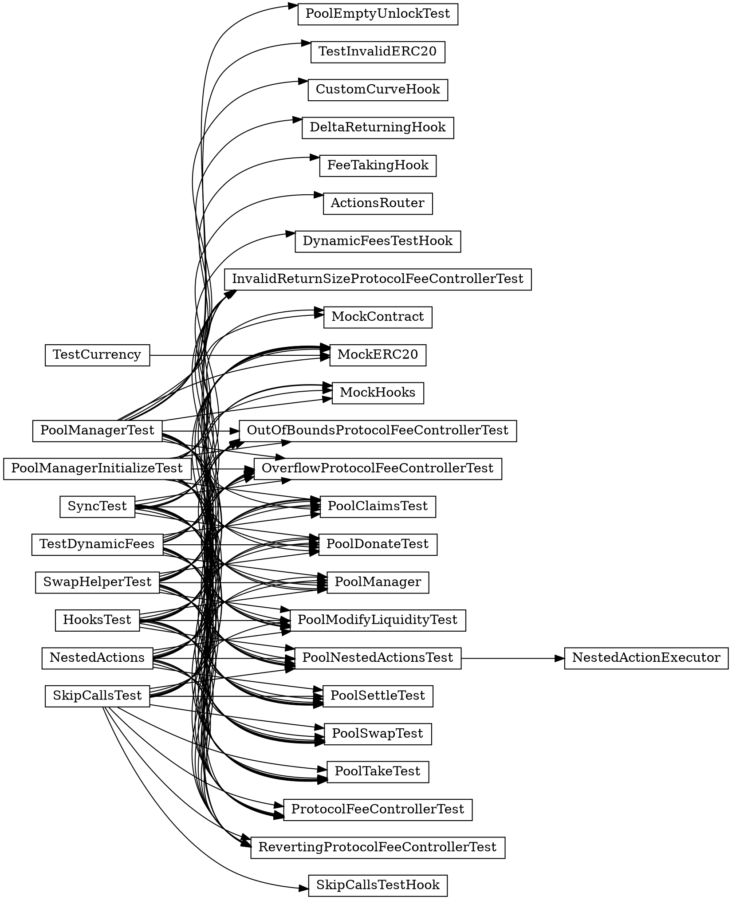

# The parasolc experiment

The goal of the experiment was to evaluate the viability of parallizing Solidity contract compilation using multiprocessing.

Parallelization was done using [parasolc](https://github.com/cameel/parasolc), a proof-of-concept Bash script that provides a limited `solc`-like CLI.
The script works by splitting the received Standard JSON input into a set of smaller compilation tasks for `solc`, executing them all in parallel and merging the results into single Standard JSON output.

## Benchmark results

The numbers in the tables below are averages from several separate runs.

### OpenZeppelin

| Compilation method                    | Real time | CPU time (total) | CPU time (sys) |
|---------------------------------------|----------:|-----------------:|---------------:|
| `baseline`                            |      39 s |             39 s |            0 s |
| `baseline` + `foundry`                |      38 s |             38 s |            1 s |
| `naive`                               |      27 s |            144 s |           15 s |
| `naive` + `solc-only`                 |      22 s |            133 s |           11 s |
| `naive` + `foundry`                   |      69 s |            194 s |           14 s |
| `clustered`                           |      28 s |            139 s |           15 s |
| `naive`     + `only-relevant-sources` |      22 s |            105 s |            6 s |
| `clustered` + `only-relevant-sources` |      25 s |            105 s |            7 s |

### Uniswap v4

| Compilation method                    | Real time | CPU time (total) | CPU time (sys) |
|---------------------------------------|----------:|-----------------:|---------------:|
| `baseline`                            |     166 s |            165 s |            1 s |
| `baseline` + `foundry`                |     170 s |            169 s |            1 s |
| `naive`                               |      76 s |            499 s |           14 s |
| `naive` + `solc-only`                 |      76 s |            499 s |           13 s |
| `naive` + `foundry`                   |     110 s |            574 s |           16 s |
| `clustered`                           |     154 s |            265 s |           11 s |
| `naive`     + `only-relevant-sources` |      79 s |            493 s |           11 s |
| `clustered` + `only-relevant-sources` |     156 s |            253 s |            9 s |

## Benchmarked configurations

### `baseline`
This is the default, non-parallel mode, where the Standard JSON input contains all source files of a
project in the `sources` array and they are all selected for compilation in `settings.outputSelection`
using wildcards (`*`).

### `naive`
The simplest way to perform parallel compilation: include all sources in the `sources` array and
use `settings.outputSelection` to request compilation of one contract at a time.

This relies on the fact that `solc` performs only as much work as necessary to generate the requested outputs.
If a contract is not selected, its source file is still analyzed, but code generation is skipped.

It should be noted that this way of compilation is affected by a currently unresolved bug in the compiler:  [Error: `Definition of base has to precede definition of derived contract` when specific file in standard-json-input `outputSelection` but works when `outputSelection` file is specific](https://github.com/ethereum/solidity/issues/12932).
Until the bug is fixed, this method requires careful ordering of the input files to avoid running into it.

### `clustered`
This method clusters together contracts which depend on each other's bytecode to avoid generating code for the same contract multiple times.
One Standard JSON input per cluster is generated.

Deploying a contract at runtime using `new` or using `.runtimeCode`/`.creationCode` requires access to the bytecode of that contract at runtime.
This forces the bytecode of the contract being accessed to be included as a subassembly in the bytecode of the accessing contract.
`solc` detects such dependencies and reuses already compiled bytecode.
This is not possible if the contracts are being compiled independently.

Clustering removes the unnecessary work at the cost of forcing the contracts to be compiled sequentially.

The information about these dependencies is available on the `ContractDefinition` node in the AST (`.contractDependencies`).
Based on it, one can build a graph of bytecode dependencies.
Each connected component of the graph represents a cluster that is best compiled together for maximum bytecode reuse.
To make this information easier to use, `parasolc` relies on a patch that adds a new, experimental output to the compiler (`compilationHints`).
The output directly assigns assigns each contract to one of such clusters.

### `relevant-sources`
This method is a filter than can be combined with others described above.
It removes the contracts that were not selected for compilation from the `sources` array in each input.

Since each source has to be analyzed by the compiler, even if no outputs depending on it are requested, this may potentially speed up compilation.

The downside of this is that the set of the input contracts may affect produced artifacts.
The compiler tries hard to guarantee that the generated bytecode stays the same but this is
not necessarily true for aritfacts which are only meant as a debugging aid.
Also, historically, this guarantee has been hard to uphold and affected by many bugs.
Including all sources in all parallel tasks vastly reduces the chances of running into one of them
by ensuring that the parser will generate the same AST IDs.
Code generation not being independent of AST IDs is the most common source of such bugs.

One example of such an artifact are the source maps, which refer to source files by IDs.
The IDs are sequential and may be different for a different set of input files.
To match the output of non-parallelized compilation, the IDs must be translated when merging the outputs.

A more problematic example are artifacts that contain IDs and names based on the AST IDs.
For example IDs and names included in `functionDebugData` and `immutableReferences` may change.
These may be impossible to translate.

Finally, note that the filter is only a partial solution, as it cannot completely eliminate
the need to analyze files multiple times.
Any imported sources will necessarily be present in more than one compilation task and analyzed
independently in each of them.

### `foundry`
`parasolc` was designed to be used with `forge` as a drop-in replacement for `solc`, via the `--use` option.
This method tests such a configuration. 

### `solc-only`
To measure the overhead of the JSON processing performed by `parasolc` itself, compilation using only
`solc` was also benchmarked as well.
This was done by first running `parasolc` separately to generate the input files and only measuring the time
it takes `solc` to compile them (in paralled, via `xargs`).
The time taken by the process of merging the JSON output to get a unified artifact is not included here either.

## Benchmarking setup

In each case the initial Standard JSON was prepared based on the input generated by `forge build --optimize --via-ir --evm-version cancun`.
The input was manually adjusted to [use the input callback](https://docs.soliditylang.org/en/develop/path-resolution.html#initial-content-of-the-virtual-filesystem)
instead of having the file content embedded directly in the Standard JSON input, which simplifies processing.

The compiler was built on commit [de0024460](https://github.com/ethereum/solidity/commit/de002446032e936320544b4d065adc755b2708d3), with an extra patch that exposes the experimental `compilerHints` output.
This is almost exactly the code that will soon be released as v0.8.26 and, most importantly, includes [the new optimizer sequence](https://github.com/ethereum/solidity/pull/15030), which significantly affects compilation times compared to v0.8.25.

Tests were performed on a mechine with 4 CPU cores (8 with hyperthreading).

### Benchmarked projects

The following projects were used as the input for benchmarking: 
- [OpenZeppelin v5.0.2](https://github.com/OpenZeppelin/openzeppelin-contracts/tree/v5.0.2)
- [Uniswap v4 snapshot as of 2024-05-10](https://github.com/Uniswap/v4-core/commit/d0700ceb251afa48df8cc26d593fe04ee5e6b775)

They both widely used and easily compile via IR with Foundry, which was the main reason for selecting them.

## Analysis

### Naive parallelization

This simple method did decrease the time it takes to finish compilation but not as much as one expect from 8 parallel processes.
The extra overhead is so large that we spend 3-4x as much work to get the same result.

### Bytecode dependency clusters

Clustering dependent contracts does not seem to have much effect on the overall compilation time, but
does affect the amount of work performed, at least in some cases.
For Uniswap the amount of work was halved compared to `naive`.

The difference comes from the fact that in OpenZeppelin there are only a few simple bytecode dependencies between contracts and avoiding recompilation does not save us much.
Uniswap, on the other hand, contains a large and complex cluster, which looks like this:

This is the only major cluster in the input, and of the remaining contracts most have no dependencies at all, and only a few form clusters of size 2 or 3.
The big cluster consists of 34 out of 151 contracts and accounts for vast majority of the compilation time:

| Case                                    | Real time | CPU time (total) | CPU time (sys) |
|-----------------------------------------|----------:|-----------------:|---------------:|
| `clustered` (only the large cluster)    |     132 s |            130 s |            3 s |
| `clustered` (all other clusters)        |      19 s |            112 s |            8 s |

Interestingly, of the contracts in the cluster, `PoolManager` is the only one which is not test code.
The contract itself does not have bytecode dependencies on any other contracts and takes only a few seconds to compile on its own.
In the rest of the cluster 9 contracts inherit from a helper contract that deploys multiple other contacts.
Each of the deployed contracts is therefore compiled even up to 10 times, wasting a lot of time in parallel compilation.

### Overhead of the optimizer

The optimizer does not seem to be the only or even main cause of the overhead.
The table below shows that a large overhead is present in unoptimized compilation as well:

| Configuration                                                  | Real time | CPU time (total) | CPU time (sys) |
|----------------------------------------------------------------|----------:|-----------------:|---------------:|
| OpenZeppelin / unoptimized / `baseline`                        |      21 s |             20 s |            1 s |
| OpenZeppelin / unoptimized / `naive`                           |      22 s |            115 s |           15 s |
| OpenZeppelin / unoptimized / `naive` + `only-relevant-sources` |      15 s |             73 s |            6 s |
| Uniswap / unoptimized / `baseline`                             |      69 s |             68 s |            1 s |
| Uniswap / unoptimized / `naive`                                |      46 s |            280 s |           16 s |
| Uniswap / unoptimized / `naive` + `only-relevant-sources`      |      41 s |            250 s |           11 s |

### Overhead of `parasolc` itself

To rule out the JSON processing of `parasolc` itself as the cause of the extra overhead we can compare
the `naive` runs with the corresponding `solc-only` runs.
As can be seen in the table, the JSON processing does visibly impact OpenZeppelin (283 contracts), but
most of the overhead is still there even without it.
On the other hand Uniswap (151 contracts) does not seem to be affected at all.

The overhead is much larger when `parasolc` is combined with Foundry.
This is due to the fact that the Standard JSON input passed in by Foundry has the source code of
all contracts embedded directly in it (instead of relying on the import callback to load it).
Just serializing and deserializing that much data multiple times in the `jq`-based pipeline is simply wasteful.
`parasolc` was primarily meant to be a simple and serve as a proof of concept, which sometimes comes at
the cost of efficiency.
An implementation meant for production could easily avoid this.

### Overhead of analysis

Even in the absence of bytecode dependency clusters and without optimization,
parallel compilation overhead is very large.
I think that most of it must be coming from repeated analysis of the same files.

The first indication is that the overhead can be reduced with the `only-relevant-sources` filter.
For example in OpenZeppelin using the filter makes the compiler perform 35% less work.
It's likely that the remaining overhead is repeated analysis as well, since the filter cannot
suppress repeated analysis resulting from contracts being pulled in via imports.

Another clue is that the overhead is present even when code generation is not requested.
The following table shows the comparison of the `naive` method performing full compilation and a modified version that stops immediately after analysis by requesting only the `metadata` output:

| Test                                                             | real time | CPU total | CPU sys |
|------------------------------------------------------------------|----------:|----------:|--------:|
| OpenZeppelin / `naive`                                           |      27 s |     144 s |    15 s |
| OpenZeppelin / analysis only / `naive`                           |      14 s |      71 s |    13 s |
| OpenZeppelin / analysis only / `naive` + `only-relevant-sources` |       8 s |      32 s |     4 s |
| Uniswap / `naive`                                                |      76 s |     499 s |    14 s |
| Uniswap / analysis only / `naive`                                |      15 s |      90 s |    10 s |
| Uniswap / analysis only / `naive` + `only-relevant-sources`      |      11 s |      68 s |     6 s |

The results show that most (sometimes all) of the overhead does come from analysis:

- For Uniswap it adds up almost perfectly: 165 s is the baseline compilation (which is dominated by code generation and optimization), ~90s is analysis, and ~250 is wasted on recompiling bytecode dependencies.
- For OpenZeppelin, it's ~40 s for baseline compilation, ~ 70s for analysis and ~10 s for `parasolc`'s JSON processing. ~25 s, however, is still unaccounted for.

## Conclusions

The Solidity compilation is easy to parallelize in a naive way, but this comes with a very high overhead.
The work performed increases by a factor of 3-4x.
This  has several causes:
1. Compilation of the same contract performed multiple times in presence of bytecode dependencies.
2. Unnecessary analysis of source files that do not affect the output.
3. Analysis of the same sources being performed multiple times due to imports.
    - It's not certain if imports completely explain the remaining overhead so there could be another, yet unknown, cause.

**Clustering based on bytecode dependencies** alleviates (1), but when clusters are very large, it may
erase the gains in compilation time.
It does not seem worth it at the extremes (very few small clusters or one big cluster) but it's
possible that it could help with medium-sized clusters.
Perhaps we should consider making the `compilerHints` output available in the compiler,
though its usefulness is uncertain and the same information can ultimately be obtained from the AST,
just with some extra steps.

Even with clustering, bytecode dependencies are a significant obstacle to parallelization and
in the long term will have to be dealt with through changes in the compilation pipeline.
A mechanism allowing reuse of the bytecode of already compiled contracts is necessary to solve this problem.

**Removing unused sources** from the input helps with (2), but it accounts only for a part of the extra work
and a significant downside is that the debug artifacts are not exactly reproducible this way.
It also has a higher risk of running into compiler bugs affecting bytecode reproducibility.

Dealing with **repeated analysis** (3) is another problem that would have to be addressed within the compiler.
Possible solutions include:

- Adjusting the compiler to do analysis in a lazy way and ignore any definitions that do
    not contribute to the requested output, just like it already happens with code generation.
    Unfortunately, given the current design of the analyzer, this would not be a simple task.
- Reuse of analysis information.
    Analysis is relatively fast already (compared to the other parts of the compiler) and
    the slowdown likely comes mostly from the amount of information being generated in parallel
    rather than the heaviness of that processing.
    Analysis artifacts could be generated for all contracts first, maximizing reuse,
    and then only code generation would be parallelized.
    
    Unfortunately this is not a simple task either.
    The compiler already offers AST import and export and compilation can be resumed from such an AST,
    but this involves repeating a large part of the analysis to recalculate properties that can be inferred
    from others.
    The format was primarily meant to be stable between releases and consumed by tools.
    Being able to *quickly* restart from it was never a goal and would require a redesign.
    The current AST format also does not contain enough information to perfectly reproduce metadata. 

**Overall**, for the time being, the simplest naive parallelization is easy enough to use
and does speed up compilation given enough CPU cores, especially for projects that do not
contain many source and bytecode dependencies.
It's, however, very inefficient and likely not good enough to be the default, given the trade-offs involved.
